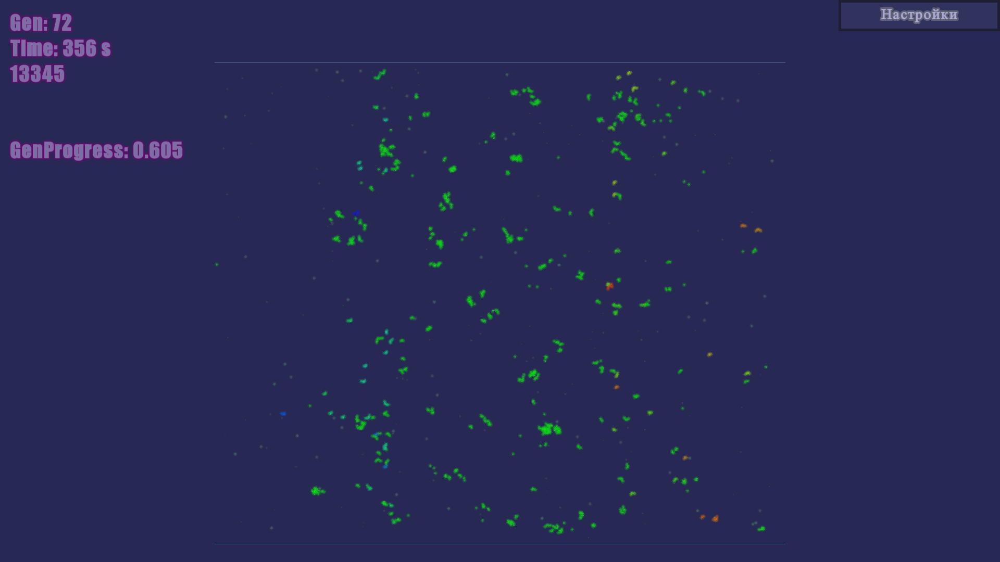

# 🧬 EvoLife — эволюция многоклеточных организмов в реальном времени

[](https://en.wikipedia.org/wiki/C%2B%2B)
[](https://www.sfml-dev.org/)
[](https://www.opengl.org/)
[](LICENSE)

**2D-симуляция искусственной жизни**, где многоклеточные организмы собирают ресурсы, обмениваются веществами, размножаются и эволюционируют под давлением естественного отбора.  
Вдохновлена проектом [The Life Engine](https://thelifeengine.net/).

<p align="center">
  
</p>

---

## 🔬 Что здесь происходит?

На огромной карте (5760×3240 пикселей) живут **организмы**, состоящие из связанных клеток.  
Каждая клетка имеет **профессию** (голова, производитель, хищник, броня, плод…) и собственный инвентарь ресурсов.  
Организмы двигаются, собирают ресурсы, перерабатывают их, растят новые клетки по **геному**, стареют и умирают.

**Ключевые механики:**

- 🧠 **Геном** — двумерный массив генов, описывающий строение организма. Мутирует при размножении.
- 🌡️ **Температурные зоны** — холод слева, жара справа; клетки реагируют на перегрев/переохлаждение.
- 🔗 **Физика связей** — итеративный PBD/FABRIK-солвер стягивает и раздвигает клетки, сохраняя форму.
- 🗺️ **Пространственная хеш-сетка** — быстрый поиск соседей для коллизий, сбора еды и охоты.
- ♻️ **Экономика ресурсов** — A, B, C (дешёвые), D, E, F (средние), G (ценный); крафт, переваривание, транспорт.
- 🛡️ **Хищники и защита** — клетки-хищники атакуют чужие организмы, броня защищает соседей.

**Типы клеток (21 профессия):** голова, производители A/B/C, переработчики, магнит, хищник, броня, проводник, плод, синтезаторы D/E/F/G, стабилизатор температуры, нагреватель/охладитель, ускоритель.

---

## 🎮 Управление

| Клавиша / Действие       | Что делает                                      |
|---------------------------|-------------------------------------------------|
| **Мышь (drag)**           | Перемещение камеры                              |
| **Колёсико мыши**         | Приближение / отдаление                         |
| **Клик по организму**     | Следить за выбранным организмом                 |
| **Пробел**                | Пауза / продолжение симуляции                   |

В левом верхнем углу отображается статистика: число клеток, компонентов, поколение, время на фазы симуляции.

---

## 🛠️ Сборка и зависимости

Проект написан на **C++17** с использованием библиотек:

- [SFML 2.5+](https://www.sfml-dev.org/) — окно, ввод, отрисовка через OpenGL
- [GLEW](http://glew.sourceforge.net/) — загрузка расширений OpenGL
- [OpenGL 3.3](https://www.opengl.org/) — рендеринг
- Стандартная библиотека Windows (только для `Sleep`) — легко убрать

### Инструкция для Visual Studio (рекомендовано)

Клонируйте репозиторий:
   ```bash
   git clone https://github.com/yourname/evolife.git
   ```
Установите SFML и GLEW (через vcpkg или вручную).

Создайте пустой проект C++, добавьте все .cpp и .hpp файлы.

Настройте пути включения и линковки:

SFML/include, SFML/lib

GLEW/include, GLEW/lib

Дополнительные зависимости: opengl32.lib, sfml-graphics.lib, sfml-window.lib, sfml-system.lib, glew32.lib

Скомпилируйте в режиме Release x64.

Запустите EvoLife.exe.

CMake-файл будет добавлен позже (Pull request приветствуется!).
